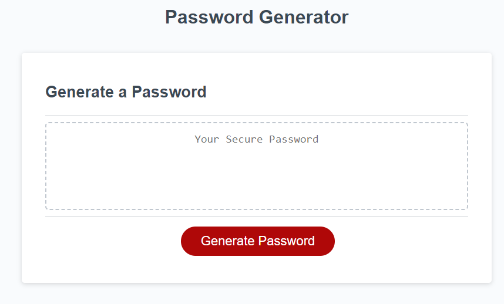

# JS Password Generator

## Description

Employer's want to view my work history and this page will display the history in an easy to follow format.

### User Story

AS AN employee with access to sensitive data
I WANT to randomly generate a password that meets certain criteria
SO THAT I can create a strong password that provides greater security

### Acceptance Criteria

GIVEN I need a new, secure password
WHEN I click the button to generate a password
THEN I am presented with a series of prompts for password criteria
WHEN prompted for password criteria
THEN I select which criteria to include in the password
WHEN prompted for the length of the password
THEN I choose a length of at least 8 characters and no more than 128 characters
WHEN asked for character types to include in the password
THEN I confirm whether or not to include lowercase, uppercase, numeric, and/or special characters
WHEN I answer each prompt
THEN my input should be validated and at least one character type should be selected
WHEN all prompts are answered
THEN a password is generated that matches the selected criteria
WHEN the password is generated
THEN the password is either displayed in an alert or written to the page

## Installation

Download the files from the repo and install on domain. Should work instantly.

## Usage

This is a responsive website that has a password generator for someone to use.

Link to view: [My JS Password Generator](https://pgold762.github.io/jsPasswordGenerator/)

Screenshot of website: 

## Credits

Used the following to help write code for randommly generating password: [W3Schools](https://www.w3schools.com/js/js_random.asp)

Used this to help know/understand what functions/methods are available: [tutorialspoint](https://www.tutorialspoint.com/javascript/javascript_builtin_functions.htm)

Used the following to understand parseInt even further than Google Search: [W3Schools](https://www.w3schools.com/jsref/jsref_parseint.asp)

Used the following to produce the prompts for character types: [W3Schools](https://www.w3schools.com/jsref/met_win_confirm.asp)

Used the following for more understanding of how arrays can be written and used: [Mozilla](https://developer.mozilla.org/en-US/docs/Web/JavaScript/Reference/Global_Objects/Array)

## License

MIT License
